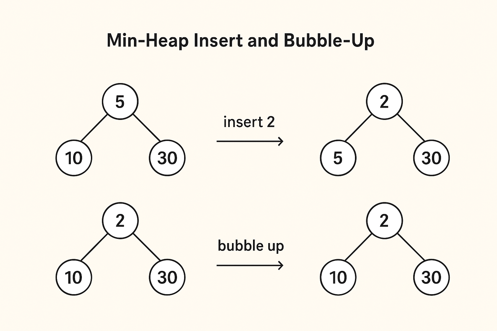

# Heap Visualization

An interactive Flutter application that visualizes heap data structure operations. This tool helps in understanding how heaps work by providing a visual representation of the heap structure and step-by-step visualization of various operations.

## Features

- Visual representation of Min and Max Heaps with an interactive diagram
- Interactive insertion and removal of elements
- Step-by-step visualization of heap operations
- Toggle between Min Heap and Max Heap
- Clean and intuitive user interface

## Visual Example


_Example of the heap visualization in action_

## Getting Started

### Prerequisites

- Flutter SDK (version 3.9.2 or later)
- Dart SDK (version 3.9.2 or later)
- An IDE (like Android Studio, VS Code, or IntelliJ) with Flutter plugin

### Installation

1. Clone the repository:

   ```bash
   git clone https://github.com/JycTheDev/flutter-heap-demo.git
   ```

2. Navigate to the project directory:

   ```bash
   cd flutter-heap-demo
   ```

3. Install dependencies:

   ```bash
   flutter pub get
   ```

4. Run the app:
   ```bash
   flutter run
   ```

## How to Use

1. **Insert Elements**: Enter a number in the text field and press the "Insert" button to add it to the heap.
2. **Remove Elements**: Click on any node to remove it from the heap.
3. **Toggle Heap Type**: Use the switch to toggle between Min Heap and Max Heap.
4. **Visualize Operations**: Watch the animation as the heap restructures after each operation.

## Dependencies

- `flutter` - The Flutter framework
- `provider` - For state management

## Contributing

Contributions are welcome! Please feel free to submit a Pull Request.

## License

This project is licensed under the MIT License - see the [LICENSE](LICENSE) file for details.

## Acknowledgments

- Built with Flutter
- Inspired by classic computer science data structure visualizations

# flutter-heap-demo
